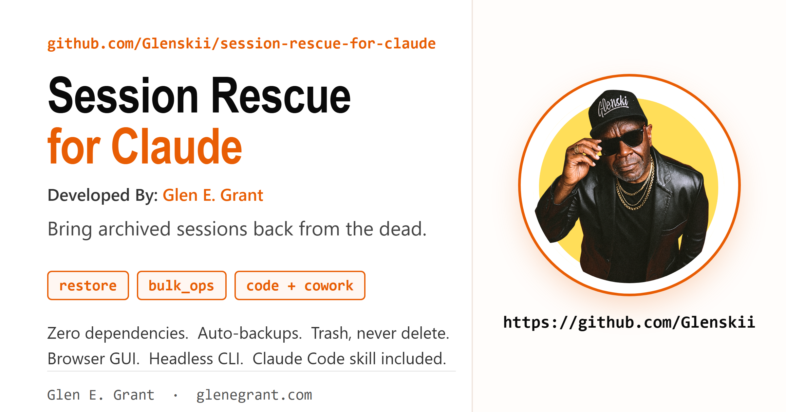
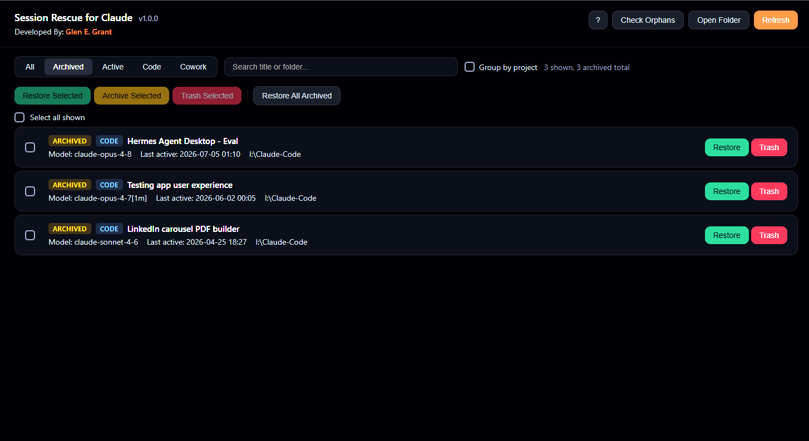
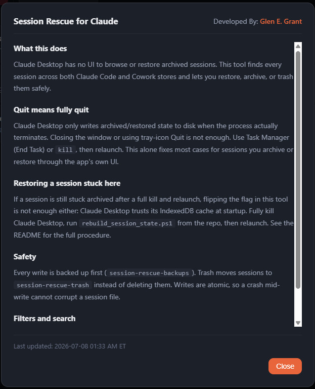
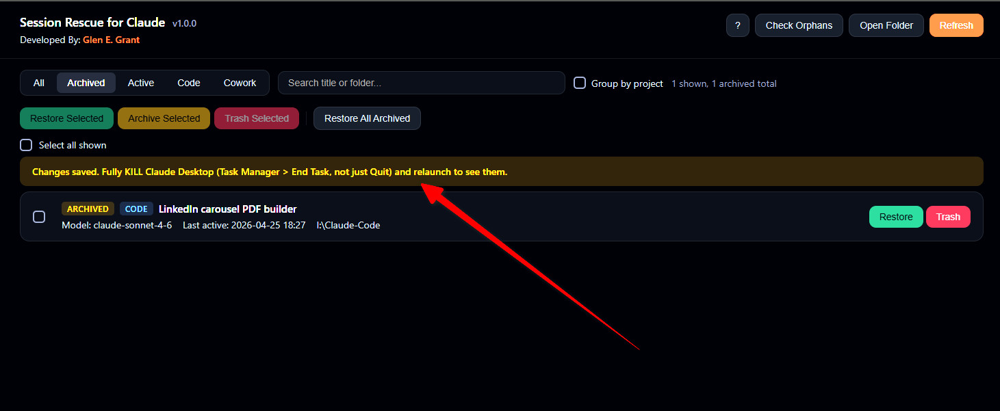
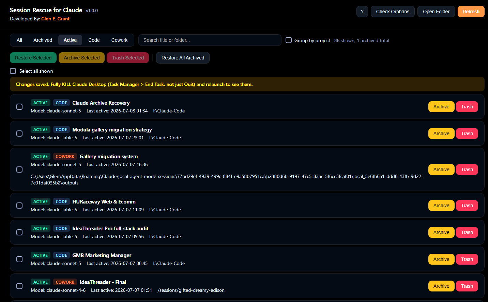

# Session Rescue for Claude

Restore, browse, and manage archived Claude Desktop sessions. Works with both **Claude Code** and **Cowork** session stores.

Developed by [Glen E. Grant](https://profile.glenegrant.com).



## The problem

Claude Desktop lets you archive a session with one click, but there is no UI to see your archived sessions or bring them back. One misclick and your project session vanishes from the sidebar with no recovery path. This tool fixes that.

## Important: quit means fully quit

Claude Desktop caches session state (including the archived flag) in its IndexedDB and only writes that cache through to the session JSON files when the process actually terminates. Closing the window or using tray-icon Quit does not reliably do this. **Use Task Manager (or `kill`/`pkill` on macOS and Linux) to fully end the process**, then relaunch. Tested and confirmed: a real process kill followed by a relaunch correctly syncs archive and restore actions taken in the app, no extra tooling needed.

If a session is still stuck archived after a full kill and relaunch (this happens to sessions that got desynced under an older build), that is what this tool and `rebuild_session_state.ps1` are for. See the Restore procedure below.

## What it does

- Finds every session across both stores: `claude-code-sessions` (Claude Code) and `local-agent-mode-sessions` (Cowork)
- Restores archived sessions, individually or in bulk
- Archives active sessions in bulk (the app only does one at a time)
- Search by title or project folder, filter by store or status, group by project
- Detects orphans: transcript folders missing their JSON, and vice versa
- Headless CLI modes for scripting

## Safety first

This tool never destroys data:

- **Automatic backups.** Every write is preceded by a timestamped copy in a `session-rescue-backups` folder inside the session store.
- **Trash, not delete.** Removing a session moves it to a `session-rescue-trash` folder. Recover it any time by moving it back.
- **Atomic writes.** Files are written to a temp file and renamed into place. A crash mid-write cannot corrupt a session.
- **Field preservation.** Only the `isArchived` flag is changed. Every other field round-trips untouched.

## Requirements

- Python 3.8 or newer
- Nothing else. Standard library only, no pip installs.

## Usage

**GUI (recommended):**

```
python claude_session_rescue.py
```

Opens a local browser UI at `http://127.0.0.1:52850`. Local only, zero external network access. Close the tab and the server shuts itself down.

**CLI:**

```
python claude_session_rescue.py --list                  # print all sessions
python claude_session_rescue.py --restore-all-archived  # bulk restore, no GUI
python claude_session_rescue.py --path "D:\custom\dir"  # custom session store
```

**Everyday use: just kill and relaunch.** Archive or restore a session from Claude Desktop's own UI, fully kill the process (Task Manager > End Task, not the tray Quit), then relaunch. That is all it takes for normal use.

**Stuck sessions (Windows, the reliable fallback):**

1. Fully kill Claude Desktop via Task Manager
2. Run:
   ```
   powershell -ExecutionPolicy Bypass -File rebuild_session_state.ps1
   ```
3. Relaunch Claude Desktop. Restored sessions appear in the sidebar.

The script refuses to run while the app is open, restores every archived session in the JSON files, and renames the IndexedDB cache folders with a timestamped `.bak` suffix so the app rebuilds from the JSONs. If anything looks wrong afterward, quit the app, delete the fresh IndexedDB folders, and strip the `.bak` suffix to roll back exactly.

On macOS and Linux the same principle applies: kill the app process, run `python3 claude_session_rescue.py --restore-all-archived`, then move the `IndexedDB/https_claude.ai_0.indexeddb.leveldb` and `.blob` folders aside before relaunching.

## How it works

Claude Desktop stores each session as a `local_<uuid>.json` file with a sibling transcript folder:

| Store | Windows location |
|-------|-----------------|
| Claude Code | `%APPDATA%\Claude\claude-code-sessions\` |
| Cowork | `%APPDATA%\Claude\local-agent-mode-sessions\` |

macOS: `~/Library/Application Support/Claude/...` and Linux: `~/.config/Claude/...` use the same folder names.

Archiving a session sets `"isArchived": true` in its JSON, and the app mirrors that state into its IndexedDB cache (`IndexedDB/https_claude.ai_0.indexeddb.*` under the Claude data folder). At startup the app trusts the cache, so a restore must flip the JSON and force a cache rebuild. Local sessions do not sync to claude.ai: the state is entirely on your machine.

## Screenshots

**Archived sessions, filtered and ready to restore or trash:**


**In-app help panel, opened from the `?` button:**


**Confirmation banner after a restore, with the real fix front and center:**


**Active sessions across Claude Code and Cowork, side by side:**


## Claude Code skill

The `skills/session-rescue/` folder contains a skill for Claude Code users. Drop it into your skills directory and Claude can list, restore, and manage sessions conversationally, following the same safety rules (backup before write, trash instead of delete, atomic writes).

## Credits

The core restore mechanism (the `isArchived` flag flip) was first documented by [SugaCrypto's cowork-archive-manager](https://github.com/SugaCrypto/cowork-archive-manager), which handles the Cowork store. This project extends the idea to Claude Code sessions and adds the safety layer, search, grouping, orphan detection, and CLI modes.

## License

MIT. See [LICENSE](LICENSE).

## Disclaimer

This tool modifies files inside Claude Desktop's data directory. It is not affiliated with or endorsed by Anthropic. The safety layer makes operations recoverable, but back up anything you cannot afford to lose. If Anthropic ships a native archived-sessions UI, use that instead and retire this happily.
